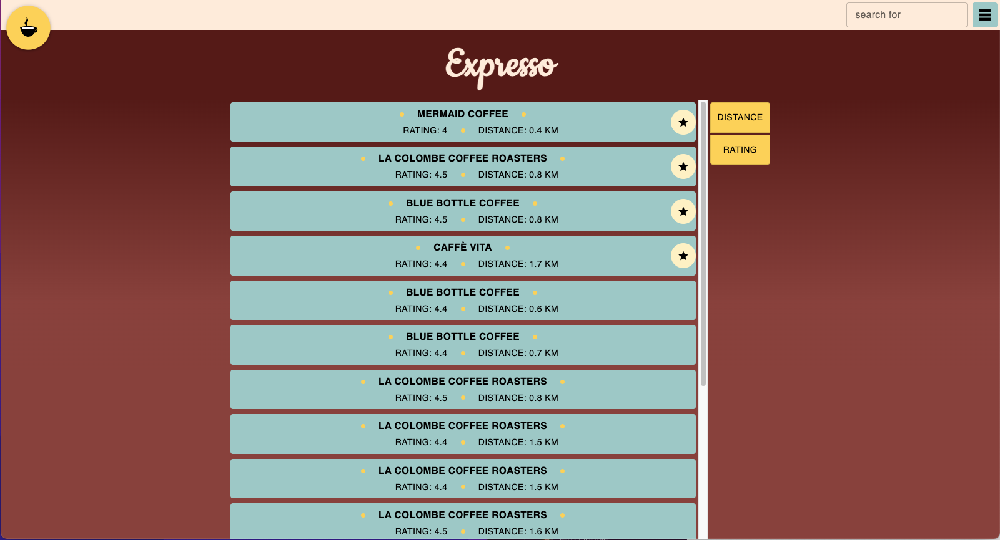
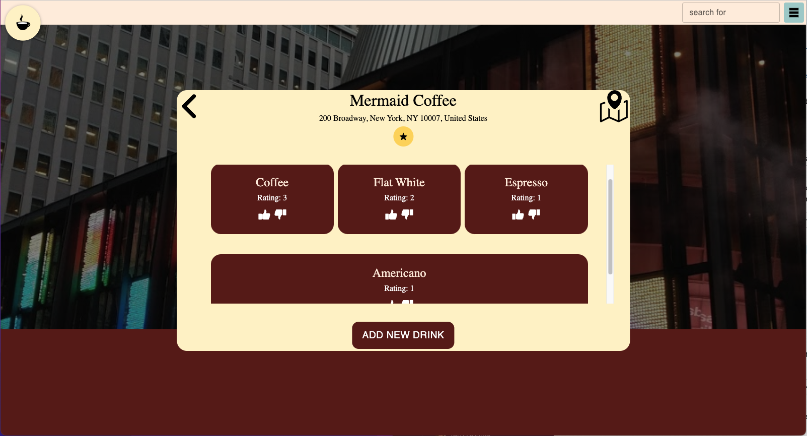

# Expresso
### Finding you coffee, wherever you go

A service to find and rate coffee shops in cities all over, for on-the-go travelers the world over.

Users can search for shops or specific drinks near their current location or a chosen destination. When logged in, users can add and rate drinks, as well as favorite shops to more easily find them again later.

## Technologies used
- Postgres
- Express
- Express Session
- React
- React Router
- Material UI
- Styled Components
- Axios
- Webpack
- Babel

## Screenshots

## Installation
- Ensure Postgres is installed, or you have access to a remote Postgres installation
- Clone the repo
- `npm install`
  - follow the onscreen prompts after the installation finishes: the app will need a Postgres username and password (and host location, though the default localhost will likely be correct) as well as a Google Places API key and a string (any value) that can be used as a "secret" for additional password security.
- `sudo PGUSER=<your postgres username> npm run clear-database`
  - Warning: this will create a database named `expresso`, if a database by that name already exists it will be dropped and remade.
- `npm run build`
- `npm start`

If the service is deployed on your local machine it will be available at localhost:3000; if it is deployed in a place where it has access to HTTPS auth keys and certificates it will be at your domain, ports 80 and 445. In the latter case, the server may need to be started with `sudo` permissions to map port 80.

## Database Schema

## UI Layouts

